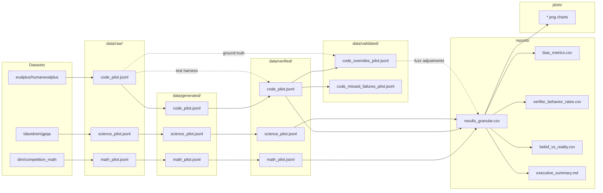

# JUDGe Pipeline — Complete Code Review & Call-Graph

## Pipeline Overview

The JUDGe project is a research pipeline that measures **LLM verifier bias** — whether LLMs judge their own generated answers differently from answers generated by other models. It operates in 4 steps:

1. **Load Data** → benchmark datasets (MATH, HumanEval+, GPQA Diamond)
2. **Generate** → 4 LLMs produce candidate answers
3. **Verify** → each LLM verifies every other LLM's answers under 3 frames × 3 strategies
4. **Validate Overrides** → fuzzing to resolve verifier vs execution disagreements (code domain only)

Plus a standalone **report.py** for post-hoc analysis (not called by the pipeline).

---

## Full Call-Graph Diagram

```mermaid
flowchart TB
    subgraph "run.py (Entry Point)"
        RUN_MAIN["__main__<br/>argparse → mode, domain"]
        RUN_SCRIPT["run_script(script_path, args_list)<br/>subprocess.run()"]
    end

    subgraph "Step 1: data_loader.py"
        DL_MAIN["__main__<br/>argparse → mode, domain"]
        DL_MATH["load_math(mode)"]
        DL_CODE["load_code(mode)"]
        DL_SCI["load_science(mode)"]
        DL_SAVE["save_data(data, domain, mode)"]
        DL_HF_MATH["HF: load_dataset('dim/competition_math')"]
        DL_HF_CODE["HF: load_dataset('evalplus/humanevalplus')"]
        DL_HF_SCI["HF: load_dataset('Idavidrein/gpqa')"]
    end

    subgraph "Step 2: generate.py"
        GEN_MAIN_ENTRY["__main__<br/>argparse → asyncio.run(main)"]
        GEN_MAIN["main(is_pilot, domains, overwrite)"]
        GEN_PROC["process_domain(domain, is_pilot, overwrite)"]
        GEN_ITEM["generate_for_item(item, domain)"]
    end

    subgraph "Step 3: verify.py"
        VER_MAIN_ENTRY["__main__<br/>argparse → asyncio.run(main)"]
        VER_MAIN["main(is_pilot, domains, overwrite)"]
        VER_PROC["process_domain(domain, is_pilot, overwrite)"]
        VER_CAND["verify_candidate(item, domain,<br/>verifier_model, generator_model,<br/>candidate_answer, frame, strategy,<br/>test_code, entry_point)"]
    end

    subgraph "Step 4: validate_overrides.py"
        VO_MAIN_ENTRY["__main__<br/>argparse → asyncio.run(main)"]
        VO_MAIN["main(is_pilot, domains)"]
        VO_PROC["process_domain(domain, is_pilot)"]
        VO_LOAD["_load_jsonl(path)"]
        VO_DONE["_already_done(path)"]
    end

    subgraph "models.py (Shared)"
        MOD_RESP["generate_response(model_name,<br/>messages, temperature,<br/>max_tokens, response_format, retries)"]
        MOD_CLIENT["AsyncOpenAI.chat.completions.create()"]
        MOD_MODELS["MODELS dict<br/>qwen, deepseek, llama, mistral"]
    end

    subgraph "prompts.py (Shared)"
        PR_GEN["get_generation_prompt(domain, question)"]
        PR_VER["get_verification_prompt(domain, question,<br/>candidate_answer, frame, strategy)"]
    end

    subgraph "execution_grounding.py"
        EG_RUN["run_candidate_code(candidate_text,<br/>test_code, entry_point, timeout)"]
        EG_EXTRACT["_extract_traceback_summary(stderr, max_chars)"]
        EG_COUNT["_count_assertions(test_code)"]
        EG_RESULT["ExecutionResult dataclass"]
        EG_PROMPT_BLOCK["ExecutionResult.to_prompt_block()"]
        EG_BUILD["build_grounded_verifier_prompt() ⚠️ DEAD CODE"]
    end

    subgraph "fuzz_validate.py"
        FZ_DIFF["differential_test(item_id,<br/>candidate_code, reference_code,<br/>entry_point, question, timeout)"]
        FZ_BUILD_PROMPT["_build_generation_prompt(question,<br/>candidate_code, reference_code)"]
        FZ_ORACLE["_ask_oracle(question, inputs,<br/>cand_result, ref_result)"]
        FZ_RENAME["_rename_reference(reference_code, entry_point)"]
        FZ_HARNESS["_HARNESS_TEMPLATE<br/>subprocess.run() execution"]
        FZ_TRIAL["TrialResult dataclass"]
        FZ_FUZZ["FuzzResult dataclass"]
    end

    subgraph "report.py (Standalone)"
        RP_MAIN["main()"]
        RP_ARGS["parse_args()"]
        RP_GRADE["load_and_grade(args)"]
        RP_FUZZ_LOAD["load_fuzz_results(args)"]
        RP_ANALYZE["analyze_verifications(args, graded, fuzz_dict)"]
        RP_REPORTS["generate_reports_and_plots(df, args, fuzz_errors)"]
        RP_MATH["grade_math(candidate_text, ground_truth)"]
        RP_MATHCMP["_math_values_equal(a, b, tol)"]
        RP_SCI["grade_science(candidate_text, ground_truth)"]
        RP_CODE["grade_code(candidate_text, test_code, entry_point)"]
        RP_BREAK["write_breakdown_section(f, title, df, ...)"]
        RP_BEHAV["write_behavior_breakdown(f, title, df, ...)"]
    end

    %% ===== run.py orchestration =====
    RUN_MAIN --> RUN_SCRIPT
    RUN_SCRIPT -->|"Step 1"| DL_MAIN
    RUN_SCRIPT -->|"Step 2"| GEN_MAIN_ENTRY
    RUN_SCRIPT -->|"Step 3"| VER_MAIN_ENTRY
    RUN_SCRIPT -->|"Step 4"| VO_MAIN_ENTRY

    %% ===== data_loader.py =====
    DL_MAIN --> DL_MATH
    DL_MAIN --> DL_CODE
    DL_MAIN --> DL_SCI
    DL_MAIN --> DL_SAVE
    DL_MATH --> DL_HF_MATH
    DL_CODE --> DL_HF_CODE
    DL_SCI --> DL_HF_SCI

    %% ===== generate.py =====
    GEN_MAIN_ENTRY --> GEN_MAIN
    GEN_MAIN --> GEN_PROC
    GEN_PROC --> GEN_ITEM
    GEN_ITEM --> PR_GEN
    GEN_ITEM --> MOD_RESP

    %% ===== verify.py =====
    VER_MAIN_ENTRY --> VER_MAIN
    VER_MAIN --> VER_PROC
    VER_PROC --> VER_CAND
    VER_CAND --> PR_VER
    VER_CAND --> MOD_RESP
    VER_CAND --> EG_RUN
    VER_CAND --> EG_PROMPT_BLOCK

    %% ===== validate_overrides.py =====
    VO_MAIN_ENTRY --> VO_MAIN
    VO_MAIN --> VO_PROC
    VO_PROC --> VO_LOAD
    VO_PROC --> VO_DONE
    VO_DONE --> VO_LOAD
    VO_PROC -->|"Case 1: override"| FZ_DIFF
    VO_PROC -->|"Case 2: missed failure"| EG_RUN

    %% ===== models.py =====
    MOD_RESP --> MOD_CLIENT

    %% ===== execution_grounding.py =====
    EG_RUN --> EG_COUNT
    EG_RUN --> EG_EXTRACT
    EG_RUN --> EG_RESULT

    %% ===== fuzz_validate.py =====
    FZ_DIFF --> FZ_BUILD_PROMPT
    FZ_DIFF --> MOD_RESP
    FZ_DIFF --> FZ_RENAME
    FZ_DIFF --> FZ_HARNESS
    FZ_DIFF --> FZ_ORACLE
    FZ_ORACLE --> MOD_RESP

    %% ===== report.py =====
    RP_MAIN --> RP_ARGS
    RP_MAIN --> RP_GRADE
    RP_MAIN --> RP_FUZZ_LOAD
    RP_MAIN --> RP_ANALYZE
    RP_MAIN --> RP_REPORTS
    RP_GRADE --> RP_MATH
    RP_GRADE --> RP_SCI
    RP_GRADE --> RP_CODE
    RP_MATH --> RP_MATHCMP
    RP_CODE --> EG_RUN
    RP_REPORTS --> RP_BREAK
    RP_REPORTS --> RP_BEHAV

    %% Styling
    classDef entry fill:#2d5a27,stroke:#1a3a17,color:#fff
    classDef shared fill:#1a3a5c,stroke:#0d2137,color:#fff
    classDef dead fill:#5c1a1a,stroke:#3a0d0d,color:#fff

    class RUN_MAIN,DL_MAIN,GEN_MAIN_ENTRY,VER_MAIN_ENTRY,VO_MAIN_ENTRY,RP_MAIN entry
    class MOD_RESP,MOD_MODELS,PR_GEN,PR_VER shared
    class EG_BUILD dead
```



---

## Cross-Module Dependency Map

| Consumer File | Imports From | What It Uses |
|---|---|---|
| [generate.py](file:///c:/Users/Sidho/OneDrive/Desktop/RESEARCH/JUDGe%20%26%20who%20verifies%20agents/src/generate.py) | [models.py](file:///c:/Users/Sidho/OneDrive/Desktop/RESEARCH/JUDGe%20%26%20who%20verifies%20agents/src/models.py) | `generate_response`, `MODELS` |
| [generate.py](file:///c:/Users/Sidho/OneDrive/Desktop/RESEARCH/JUDGe%20%26%20who%20verifies%20agents/src/generate.py) | [prompts.py](file:///c:/Users/Sidho/OneDrive/Desktop/RESEARCH/JUDGe%20%26%20who%20verifies%20agents/src/prompts.py) | `get_generation_prompt` |
| [verify.py](file:///c:/Users/Sidho/OneDrive/Desktop/RESEARCH/JUDGe%20%26%20who%20verifies%20agents/src/verify.py) | [models.py](file:///c:/Users/Sidho/OneDrive/Desktop/RESEARCH/JUDGe%20%26%20who%20verifies%20agents/src/models.py) | `generate_response`, `MODELS` |
| [verify.py](file:///c:/Users/Sidho/OneDrive/Desktop/RESEARCH/JUDGe%20%26%20who%20verifies%20agents/src/verify.py) | [prompts.py](file:///c:/Users/Sidho/OneDrive/Desktop/RESEARCH/JUDGe%20%26%20who%20verifies%20agents/src/prompts.py) | `get_verification_prompt` |
| [verify.py](file:///c:/Users/Sidho/OneDrive/Desktop/RESEARCH/JUDGe%20%26%20who%20verifies%20agents/src/verify.py) | [execution_grounding.py](file:///c:/Users/Sidho/OneDrive/Desktop/RESEARCH/JUDGe%20%26%20who%20verifies%20agents/src/execution_grounding.py) | `run_candidate_code` |
| [validate_overrides.py](file:///c:/Users/Sidho/OneDrive/Desktop/RESEARCH/JUDGe%20%26%20who%20verifies%20agents/src/validate_overrides.py) | [execution_grounding.py](file:///c:/Users/Sidho/OneDrive/Desktop/RESEARCH/JUDGe%20%26%20who%20verifies%20agents/src/execution_grounding.py) | `run_candidate_code` |
| [validate_overrides.py](file:///c:/Users/Sidho/OneDrive/Desktop/RESEARCH/JUDGe%20%26%20who%20verifies%20agents/src/validate_overrides.py) | [fuzz_validate.py](file:///c:/Users/Sidho/OneDrive/Desktop/RESEARCH/JUDGe%20%26%20who%20verifies%20agents/src/fuzz_validate.py) | `differential_test` |
| [fuzz_validate.py](file:///c:/Users/Sidho/OneDrive/Desktop/RESEARCH/JUDGe%20%26%20who%20verifies%20agents/src/fuzz_validate.py) | [models.py](file:///c:/Users/Sidho/OneDrive/Desktop/RESEARCH/JUDGe%20%26%20who%20verifies%20agents/src/models.py) | `generate_response` |
| [report.py](file:///c:/Users/Sidho/OneDrive/Desktop/RESEARCH/JUDGe%20%26%20who%20verifies%20agents/src/report.py) | [execution_grounding.py](file:///c:/Users/Sidho/OneDrive/Desktop/RESEARCH/JUDGe%20%26%20who%20verifies%20agents/src/execution_grounding.py) | `run_candidate_code` |

---

## Data Flow Diagram



---

## File-by-File Review

### 1. [run.py](file:///c:/Users/Sidho/OneDrive/Desktop/RESEARCH/JUDGe%20%26%20who%20verifies%20agents/run.py) — Pipeline Orchestrator

| Function | Purpose |
|---|---|
| `run_script(script_path, args_list)` | Spawns a subprocess for each pipeline step |

> [!NOTE]
> **`report.py` is never called by the pipeline.** Steps 1–4 are automated, but report generation must be run manually. This may be intentional.

**No bugs found.** Logic is straightforward and correct.

---

### 2. [data_loader.py](file:///c:/Users/Sidho/OneDrive/Desktop/RESEARCH/JUDGe%20%26%20who%20verifies%20agents/src/data_loader.py) — Dataset Loading

| Function | Purpose |
|---|---|
| `load_math(mode)` | Loads MATH dataset, samples 10/150 items |
| `load_code(mode)` | Loads HumanEval+ dataset, samples 10/150 items |
| `load_science(mode)` | Loads GPQA Diamond, shuffles answer options per-item |
| `save_data(data, domain, mode)` | Appends new items to JSONL with resume support |

> [!TIP]
> **Minor style issue** — `import random` on [line 68](file:///c:/Users/Sidho/OneDrive/Desktop/RESEARCH/JUDGe%20%26%20who%20verifies%20agents/src/data_loader.py#L68) is inside the `for` loop. Move it to the top of the file for clarity (no functional impact since Python caches imports).

**No bugs found.** Resume logic and per-item option shuffling are correct.

---

### 3. [models.py](file:///c:/Users/Sidho/OneDrive/Desktop/RESEARCH/JUDGe%20%26%20who%20verifies%20agents/src/models.py) — LLM API Client

| Function | Purpose |
|---|---|
| `generate_response(...)` | Async call to DeepInfra with retry + exponential backoff |

**No bugs found.** Clean implementation.

---

### 4. [prompts.py](file:///c:/Users/Sidho/OneDrive/Desktop/RESEARCH/JUDGe%20%26%20who%20verifies%20agents/src/prompts.py) — Prompt Templates

| Function | Purpose |
|---|---|
| `get_generation_prompt(domain, question)` | Builds solver prompt per domain |
| `get_verification_prompt(domain, question, candidate_answer, frame, strategy)` | Builds verifier prompt with ownership frame + strategy |

**No bugs found.** All branches properly raise `ValueError` for unknown inputs.

---

### 5. [generate.py](file:///c:/Users/Sidho/OneDrive/Desktop/RESEARCH/JUDGe%20%26%20who%20verifies%20agents/src/generate.py) — Candidate Answer Generation

| Function | Purpose |
|---|---|
| `generate_for_item(item, domain)` | Generates answers from all 4 models concurrently |
| `process_domain(domain, is_pilot, overwrite)` | Processes a domain in batches of 5 with resume |
| `main(is_pilot, domains, overwrite)` | Iterates over domains |

> [!NOTE]
> **Misleading comment** on [line 24](file:///c:/Users/Sidho/OneDrive/Desktop/RESEARCH/JUDGe%20%26%20who%20verifies%20agents/src/generate.py#L24): says `temperature=0.7` but code uses `0.0`. The comment is outdated.

**No bugs found.**

---

### 6. [verify.py](file:///c:/Users/Sidho/OneDrive/Desktop/RESEARCH/JUDGe%20%26%20who%20verifies%20agents/src/verify.py) — Verification Pipeline

| Function | Purpose |
|---|---|
| `verify_candidate(...)` | Builds prompt, calls LLM, parses JSON verdict, tracks overrides |
| `process_domain(...)` | Runs all 4×4×3×3 verification combos with resume |
| `main(...)` | Iterates over domains |

> [!WARNING]
> **Unused import** — `traceback` is imported on [line 12](file:///c:/Users/Sidho/OneDrive/Desktop/RESEARCH/JUDGe%20%26%20who%20verifies%20agents/src/verify.py#L12) but never used. Remove it.

> [!NOTE]
> The JSON fallback parser on [lines 90–112](file:///c:/Users/Sidho/OneDrive/Desktop/RESEARCH/JUDGe%20%26%20who%20verifies%20agents/src/verify.py#L90-L112) is well-designed with 3 progressive strategies (direct parse → markdown block → brace extraction). The `{{` edge case fix on line 106 is narrow but handles a known model quirk.

**No bugs found.** Core logic is correct.

---

### 7. [execution_grounding.py](file:///c:/Users/Sidho/OneDrive/Desktop/RESEARCH/JUDGe%20%26%20who%20verifies%20agents/src/execution_grounding.py) — Code Execution Engine

| Function | Purpose |
|---|---|
| `ExecutionResult` | Dataclass holding execution results |
| `to_prompt_block()` | Renders execution results as text for verifier prompts |
| `_extract_traceback_summary(stderr)` | Pulls last frame + exception from traceback |
| `_count_assertions(test_code)` | Counts `assert` statements in test harness |

> [!WARNING]
> **`to_prompt_block()` displays `"Assertions: None/X passed"`** — When execution fails, `tests_passed` is set to `None` but `tests_total` is set, so [line 45](file:///c:/Users/Sidho/OneDrive/Desktop/RESEARCH/JUDGe%20%26%20who%20verifies%20agents/src/execution_grounding.py#L45) renders `Assertions: None/15 passed` in the verifier prompt, which is confusing. Should skip the line or show `0/X` when tests_passed is None.
| `run_candidate_code(...)` | Runs candidate + test code in subprocess |
| `build_grounded_verifier_prompt(...)` | ⚠️ **DEAD CODE** — never called anywhere |

> [!WARNING]
> **`build_grounded_verifier_prompt()`** on [lines 144–188](file:///c:/Users/Sidho/OneDrive/Desktop/RESEARCH/JUDGe%20%26%20who%20verifies%20agents/src/execution_grounding.py#L144-L188) is never called by any file in the project. `verify.py` builds its own prompt by composing `get_verification_prompt()` + `ExecutionResult.to_prompt_block()` directly. This appears to be a leftover from an earlier design iteration. Consider removing it to avoid confusion.

> [!IMPORTANT]
> **`python` vs `sys.executable`** — [Line 115](file:///c:/Users/Sidho/OneDrive/Desktop/RESEARCH/JUDGe%20%26%20who%20verifies%20agents/src/execution_grounding.py#L115) uses `["python", tmp_name]` while `run.py` uses `sys.executable`. If the user's venv activates `python3` but not `python`, this could fail. Using `sys.executable` would be more robust.

> [!CAUTION]
> **Markdown code fences in candidate code** — If a generator LLM wraps its output in ` ```python ... ``` ` markdown blocks, [line 104](file:///c:/Users/Sidho/OneDrive/Desktop/RESEARCH/JUDGe%20%26%20who%20verifies%20agents/src/execution_grounding.py#L104) concatenates this directly into the `.py` file causing an immediate `SyntaxError`. The code should strip markdown fences before execution.

---

### 8. [fuzz_validate.py](file:///c:/Users/Sidho/OneDrive/Desktop/RESEARCH/JUDGe%20%26%20who%20verifies%20agents/src/fuzz_validate.py) — Differential Fuzzing

| Function | Purpose |
|---|---|
| `TrialResult` | Dataclass for per-input comparison results |
| `FuzzResult` | Dataclass for overall fuzzing verdict |
| `_build_generation_prompt(...)` | Prompt asking LLM to generate adversarial inputs |
| `_ask_oracle(...)` | LLM oracle to resolve ambiguous mismatches |
| `_rename_reference(...)` | Renames reference function to avoid name collision |
| `differential_test(...)` | Main entry: generate inputs → run both → compare → oracle |

> [!NOTE]
> **Duplicate guard** — [Line 266](file:///c:/Users/Sidho/OneDrive/Desktop/RESEARCH/JUDGe%20%26%20who%20verifies%20agents/src/fuzz_validate.py#L266) re-checks `if not reference_code or not reference_code.strip()` which is **unreachable dead code** since [line 213](file:///c:/Users/Sidho/OneDrive/Desktop/RESEARCH/JUDGe%20%26%20who%20verifies%20agents/src/fuzz_validate.py#L213) already returned in that case.

> [!NOTE]
> **External model IDs** — `_ask_oracle` uses `"microsoft/WizardLM-2-8x22B"` ([line 103](file:///c:/Users/Sidho/OneDrive/Desktop/RESEARCH/JUDGe%20%26%20who%20verifies%20agents/src/fuzz_validate.py#L103)) and `differential_test` uses `"google/gemma-2-27b-it"` ([line 228](file:///c:/Users/Sidho/OneDrive/Desktop/RESEARCH/JUDGe%20%26%20who%20verifies%20agents/src/fuzz_validate.py#L228)). These fall through `MODELS.get(model_name, model_name)` as raw DeepInfra IDs. This is intentional (independent models) but fragile — if either is removed from DeepInfra, the fallback is `None` → `"ERROR"` verdict.

> [!WARNING]
> **`*args` unpacking in harness template** — [Lines 150/155](file:///c:/Users/Sidho/OneDrive/Desktop/RESEARCH/JUDGe%20%26%20who%20verifies%20agents/src/fuzz_validate.py#L150-L155): `{entry_point}(*args)` assumes each LLM-generated input is a list of positional arguments. If a function expects a single list argument (e.g., `def sort_list(lst)`), and the LLM generates `[1, 2, 3]`, `*args` unpacks it into 3 separate arguments → `TypeError`. Both implementations crash identically, masking the actual bug.

> [!NOTE]
> **Oracle only checks first mismatch** — [Line 336](file:///c:/Users/Sidho/OneDrive/Desktop/RESEARCH/JUDGe%20%26%20who%20verifies%20agents/src/fuzz_validate.py#L336): If multiple trials fail, only `mismatches[0]` goes to the oracle. If that first input was ambiguous, a real bug in later trials gets missed.

---

### 9. [validate_overrides.py](file:///c:/Users/Sidho/OneDrive/Desktop/RESEARCH/JUDGe%20%26%20who%20verifies%20agents/src/validate_overrides.py) — Override Validation (Step 4)

| Function | Purpose |
|---|---|
| `_load_jsonl(path)` | Loads JSONL file to list of dicts |
| `_already_done(path)` | Returns set of processed 5-tuples for resume |
| `process_domain(domain, is_pilot)` | Validates override/missed-failure cases |
| `main(is_pilot, domains)` | Iterates over domains (only `"code"` does work) |

**No bugs found.** Clean, well-structured resume logic.

---

### 10. [report.py](file:///c:/Users/Sidho/OneDrive/Desktop/RESEARCH/JUDGe%20%26%20who%20verifies%20agents/src/report.py) — Analysis & Reporting

| Function | Purpose |
|---|---|
| `parse_args()` | CLI argument parsing |
| `grade_science(...)` | Extracts letter answer, compares to ground truth |
| `_math_values_equal(a, b)` | Numeric or exact string comparison |
| `grade_math(...)` | Extracts boxed/numeric answer, compares |
| `grade_code(...)` | Runs code via `run_candidate_code`, checks pass |
| `load_and_grade(args)` | Grades all candidates across domains |
| `load_fuzz_results(args)` | Loads fuzzer overrides from validated data |
| `analyze_verifications(...)` | Builds granular DataFrame with TP/FP/TN/FN, dissociation, belief-vs-reality |
| `write_breakdown_section(...)` | Writes metric breakdowns to summary |
| `write_behavior_breakdown(...)` | Writes behavior rate tables to summary |
| `generate_reports_and_plots(...)` | Produces CSV, plots, and executive summary markdown |
| `main()` | Orchestrates grading → analysis → reporting |

> [!WARNING]
> **Bare `except:` clauses** on [lines 356](file:///c:/Users/Sidho/OneDrive/Desktop/RESEARCH/JUDGe%20%26%20who%20verifies%20agents/src/report.py#L356) and [358](file:///c:/Users/Sidho/OneDrive/Desktop/RESEARCH/JUDGe%20%26%20who%20verifies%20agents/src/report.py#L358) catch **all** exceptions including `KeyboardInterrupt` and `SystemExit`. Should be `except Exception:`.

> [!WARNING]
> **`grade_math` false-positive risk** — [Lines 50–60](file:///c:/Users/Sidho/OneDrive/Desktop/RESEARCH/JUDGe%20%26%20who%20verifies%20agents/src/report.py#L50-L60): When no `\boxed{}` is present, it scans ALL numbers in the candidate text. If any intermediate calculation step happens to contain the ground truth value (e.g., "Start with 5... final answer is 42" would match ground truth `5`), it grades the answer as correct. Consider requiring the match to appear near the end of the text.

> [!NOTE]
> **Dissociation detection is one-directional** — [Lines 167–176](file:///c:/Users/Sidho/OneDrive/Desktop/RESEARCH/JUDGe%20%26%20who%20verifies%20agents/src/report.py#L167-L176): Only checks `parsed == True AND negative keywords present`. Doesn't detect the reverse case (verdict `False` with entirely positive reasoning), missing half the dissociation phenomenon. Also, substring matching can false-alarm on phrases like "There is no error" matching `error`.

> [!NOTE]
> **Confusing legacy flag** — `--is_pilot` ([line 19](file:///c:/Users/Sidho/OneDrive/Desktop/RESEARCH/JUDGe%20%26%20who%20verifies%20agents/src/report.py#L19)) overlaps with `--mode pilot`. The interaction on [line 74](file:///c:/Users/Sidho/OneDrive/Desktop/RESEARCH/JUDGe%20%26%20who%20verifies%20agents/src/report.py#L74) (`mode = "pilot" if args.is_pilot else args.mode`) works but is confusing.

---

## Summary of All Issues Found

| Severity | File | Line(s) | Issue |
|---|---|---|---|
| 🔴 High | [execution_grounding.py](file:///c:/Users/Sidho/OneDrive/Desktop/RESEARCH/JUDGe%20%26%20who%20verifies%20agents/src/execution_grounding.py) | 104 | Markdown code fences in candidate output cause `SyntaxError` when executed |
| 🔴 High | [report.py](file:///c:/Users/Sidho/OneDrive/Desktop/RESEARCH/JUDGe%20%26%20who%20verifies%20agents/src/report.py) | 50–60 | `grade_math` can match intermediate calculation values as the final answer |
| 🟡 Medium | [fuzz_validate.py](file:///c:/Users/Sidho/OneDrive/Desktop/RESEARCH/JUDGe%20%26%20who%20verifies%20agents/src/fuzz_validate.py) | 150–155 | `*args` unpacking crashes on single-list-argument functions |
| 🟡 Medium | [report.py](file:///c:/Users/Sidho/OneDrive/Desktop/RESEARCH/JUDGe%20%26%20who%20verifies%20agents/src/report.py) | 167–176 | Dissociation detection is asymmetric and substring-based (false alarms) |
| 🟡 Medium | [execution_grounding.py](file:///c:/Users/Sidho/OneDrive/Desktop/RESEARCH/JUDGe%20%26%20who%20verifies%20agents/src/execution_grounding.py) | 45 | `to_prompt_block()` renders `Assertions: None/X passed` on failures |
| ⚠️ Low | [verify.py](file:///c:/Users/Sidho/OneDrive/Desktop/RESEARCH/JUDGe%20%26%20who%20verifies%20agents/src/verify.py) | 12 | Unused `import traceback` |
| ⚠️ Low | [execution_grounding.py](file:///c:/Users/Sidho/OneDrive/Desktop/RESEARCH/JUDGe%20%26%20who%20verifies%20agents/src/execution_grounding.py) | 144–188 | `build_grounded_verifier_prompt()` is dead code (never called) |
| ⚠️ Low | [execution_grounding.py](file:///c:/Users/Sidho/OneDrive/Desktop/RESEARCH/JUDGe%20%26%20who%20verifies%20agents/src/execution_grounding.py) | 115 | Uses `"python"` instead of `sys.executable` |
| ⚠️ Low | [fuzz_validate.py](file:///c:/Users/Sidho/OneDrive/Desktop/RESEARCH/JUDGe%20%26%20who%20verifies%20agents/src/fuzz_validate.py) | 266 | Duplicate unreachable `reference_code` guard |
| ⚠️ Low | [fuzz_validate.py](file:///c:/Users/Sidho/OneDrive/Desktop/RESEARCH/JUDGe%20%26%20who%20verifies%20agents/src/fuzz_validate.py) | 336 | Oracle only checks first mismatch, may miss real bugs in later trials |
| ⚠️ Low | [report.py](file:///c:/Users/Sidho/OneDrive/Desktop/RESEARCH/JUDGe%20%26%20who%20verifies%20agents/src/report.py) | 356, 358 | Bare `except:` should be `except Exception:` |
| ⚠️ Low | [data_loader.py](file:///c:/Users/Sidho/OneDrive/Desktop/RESEARCH/JUDGe%20%26%20who%20verifies%20agents/src/data_loader.py) | 4 | Unused `import pandas as pd` |
| ⚠️ Low | [models.py](file:///c:/Users/Sidho/OneDrive/Desktop/RESEARCH/JUDGe%20%26%20who%20verifies%20agents/src/models.py) | 2 | Unused `import json` |
| 💡 Style | [data_loader.py](file:///c:/Users/Sidho/OneDrive/Desktop/RESEARCH/JUDGe%20%26%20who%20verifies%20agents/src/data_loader.py) | 68 | `import random` inside loop body |
| 💡 Style | [generate.py](file:///c:/Users/Sidho/OneDrive/Desktop/RESEARCH/JUDGe%20%26%20who%20verifies%20agents/src/generate.py) | 20, 24 | Outdated comments ("GLM" model, `temperature=0.7`) |
| 💡 Style | [report.py](file:///c:/Users/Sidho/OneDrive/Desktop/RESEARCH/JUDGe%20%26%20who%20verifies%20agents/src/report.py) | 19, 74 | Legacy `--is_pilot` flag creates confusion with `--mode` |
| ℹ️ Note | [run.py](file:///c:/Users/Sidho/OneDrive/Desktop/RESEARCH/JUDGe%20%26%20who%20verifies%20agents/run.py) | — | `report.py` is never called by the pipeline (must be run manually) |
| ℹ️ Note | [fuzz_validate.py](file:///c:/Users/Sidho/OneDrive/Desktop/RESEARCH/JUDGe%20%26%20who%20verifies%20agents/src/fuzz_validate.py) | 103, 228 | External model IDs hardcoded (fragile if removed from DeepInfra) |

---

## Overall Verdict

> [!TIP]
> **The codebase is well-architected.** The pipeline design is clean with proper separation of concerns, all resume mechanisms work correctly, and there are no data corruption risks. The 2 high-severity issues (`grade_math` false positives, markdown fence stripping) are edge cases that may or may not manifest depending on model behavior, but are worth addressing before the full-scale run. The medium issues (dissociation asymmetry, `*args` unpacking, `None/X` display) are real but have limited blast radius. Everything else is cosmetic cleanup.
