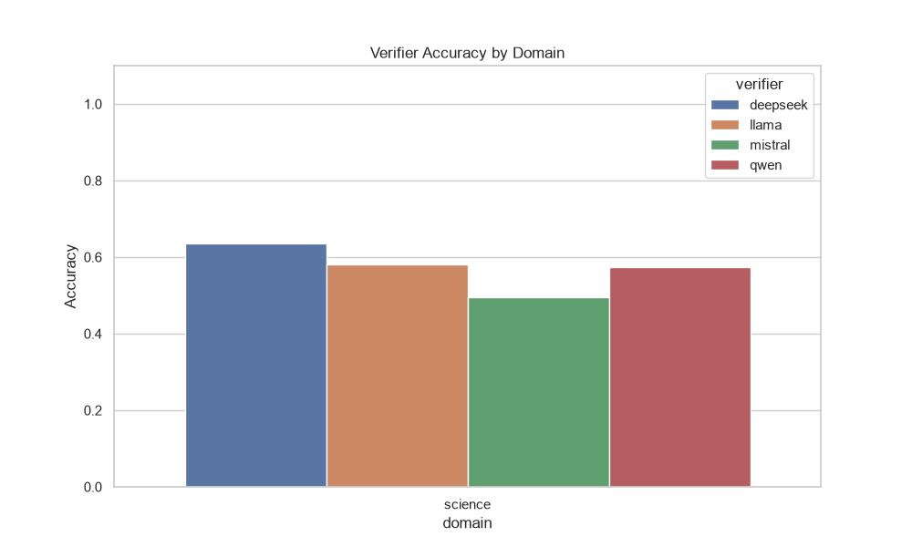
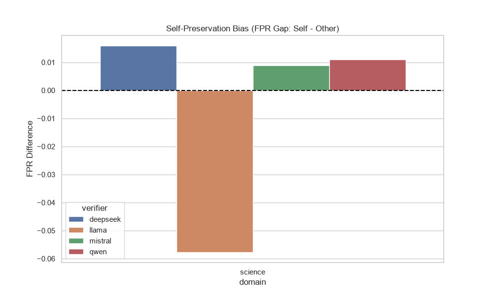
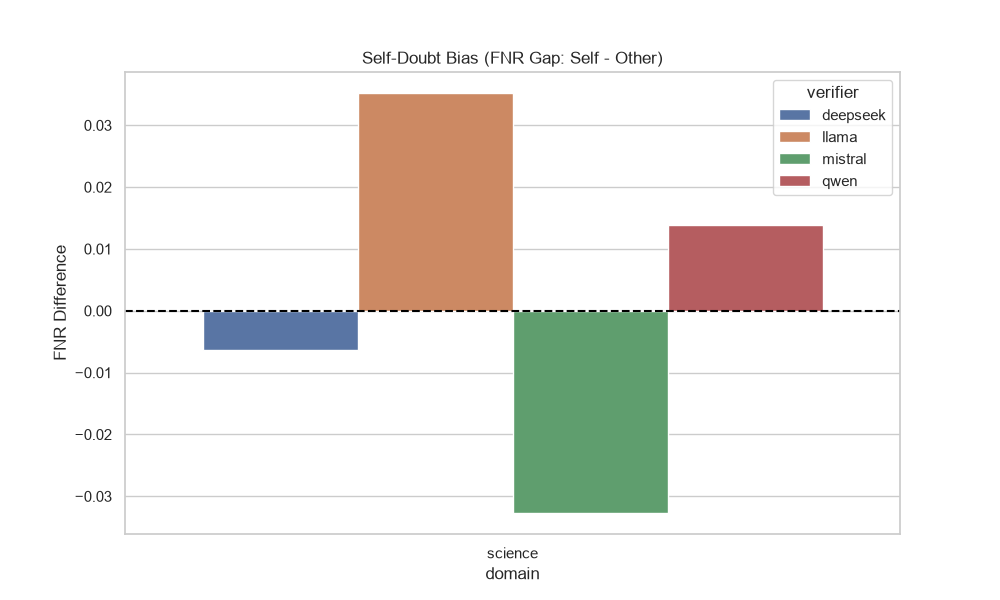
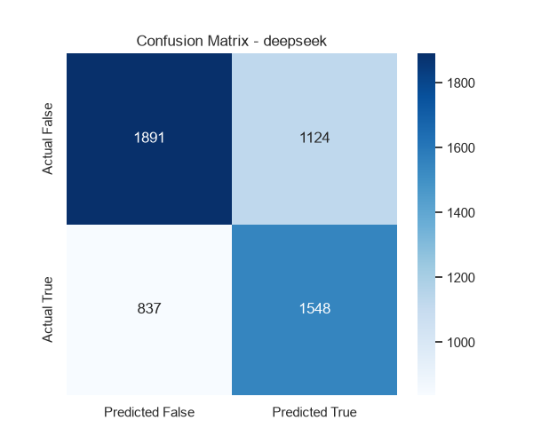
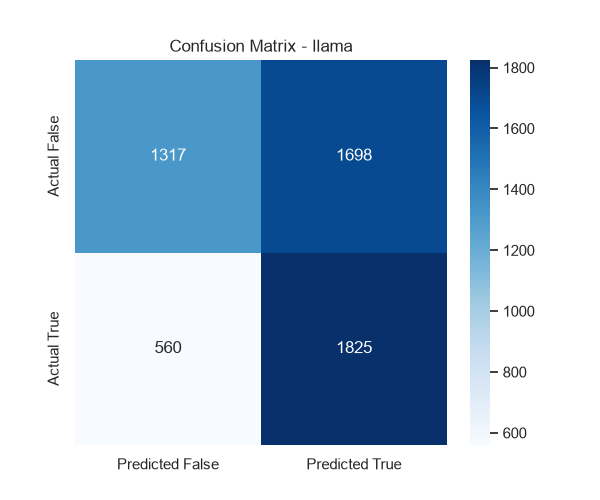
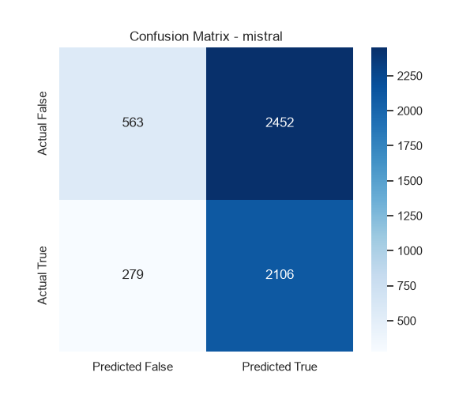

# Dynamic Executive Summary

**Total Verifications Processed:** 21600

## Highest Accuracy by Domain

- **Science**: deepseek (Frame: other, Strategy: cot) achieved **65.8%** accuracy (**65.8% Adjusted**).

## Model Preferences by Domain (Best Configurations)
### Science
- **deepseek**: Prefers **other** frame & **cot** strategy (**65.8%**)
- **llama**: Prefers **self** frame & **cot** strategy (**60.8%**)
- **mistral**: Prefers **self** frame & **rubric** strategy (**53.0%**)
- **qwen**: Prefers **neutral** frame & **rubric** strategy (**59.2%**)

## Strategy Performance per Model (Raw Accuracy)
| Model | cot | direct | rubric |
|-------|---|---|---|
| **deepseek** | 64.7% | 63.1% | 63.3% |
| **llama** | 59.4% | 56.4% | 58.7% |
| **mistral** | 50.2% | 46.5% | 51.6% |
| **qwen** | 57.5% | 56.3% | 58.5% |

## Strategy Performance per Model (Adjusted Accuracy)
| Model | cot | direct | rubric |
|-------|---|---|---|
| **deepseek** | 64.7% | 63.1% | 63.3% |
| **llama** | 59.4% | 56.4% | 58.7% |
| **mistral** | 50.2% | 46.5% | 51.6% |
| **qwen** | 57.5% | 56.3% | 58.5% |

## 1. Comprehensive Accuracy Breakdown (Raw)
### Overall Average Across Everything
- **Overall**: 57.2%
### By Domain
- **Science**: 57.2%
### By Strategy
- **cot**: 58.0%
- **direct**: 55.6%
- **rubric**: 58.0%
### By Ownership Frame
- **neutral**: 56.6%
- **other**: 57.4%
- **self**: 57.6%
### By Model
- **deepseek**: 63.7%
- **llama**: 58.2%
- **mistral**: 49.4%
- **qwen**: 57.4%
### Top 3 Best Ownership + Strategy Combos
- **other + cot**: 58.5%
- **self + rubric**: 58.4%
- **self + cot**: 58.3%

## 1b. Comprehensive Accuracy Breakdown (Adjusted)
### Overall Average Across Everything
- **Overall**: 57.2%
### By Domain
- **Science**: 57.2%
### By Strategy
- **cot**: 58.0%
- **direct**: 55.6%
- **rubric**: 58.0%
### By Ownership Frame
- **neutral**: 56.6%
- **other**: 57.4%
- **self**: 57.6%
### By Model
- **deepseek**: 63.7%
- **llama**: 58.2%
- **mistral**: 49.4%
- **qwen**: 57.4%
### Top 3 Best Ownership + Strategy Combos
- **other + cot**: 58.5%
- **self + rubric**: 58.4%
- **self + cot**: 58.3%

## 2. Formatting Failure Rates (NaN / Instructions Missed)
### Overall Average Across Everything
- **Overall**: 0.0%
### By Domain
- **Science**: 0.0%
### By Strategy
- **cot**: 0.0%
- **direct**: 0.0%
- **rubric**: 0.0%
### By Ownership Frame
- **neutral**: 0.0%
- **other**: 0.0%
- **self**: 0.0%
### By Model
- **deepseek**: 0.0%
- **llama**: 0.0%
- **mistral**: 0.0%
- **qwen**: 0.0%
### Top 3 Best Ownership + Strategy Combos
- **neutral + cot**: 0.0%
- **neutral + direct**: 0.0%
- **neutral + rubric**: 0.0%

## 3. Verbosity Analysis (Average Characters)
### Overall Average Across Everything
- **Overall**: 210.6
### By Domain
- **Science**: 210.6
### By Strategy
- **cot**: 352.4
- **direct**: 0.0
- **rubric**: 279.5
### By Ownership Frame
- **neutral**: 209.7
- **other**: 210.3
- **self**: 211.8
### By Model
- **deepseek**: 206.0
- **llama**: 253.6
- **mistral**: 187.5
- **qwen**: 195.4
### Top 3 Best Ownership + Strategy Combos
- **self + cot**: 354.9
- **other + cot**: 351.5
- **neutral + cot**: 350.7

## 4. Dissociation Rates (Hallucinated Verdicts)
### Overall Average Across Everything
- **Overall**: 14.9%
### By Domain
- **Science**: 14.9%
### By Strategy
- **cot**: 14.5%
- **rubric**: 15.2%
### By Ownership Frame
- **neutral**: 14.6%
- **other**: 14.7%
- **self**: 15.3%
### By Model
- **deepseek**: 18.8%
- **llama**: 17.6%
- **mistral**: 6.4%
- **qwen**: 16.8%
### Top 3 Best Ownership + Strategy Combos
- **neutral + cot**: 14.0%
- **other + cot**: 14.6%
- **other + rubric**: 14.8%

### Dissociation Deep Dive (Reasoning vs Label)
Out of 2142 hallucinated verifications:
- **Label was Right / Reasoning was Wrong**: 65.3% of the time.
- **Reasoning was Right / Label was Wrong**: 34.7% of the time.

## 5. Verifier Behavior Rates
### Overall Averages
- **Overall** -> Caught: 41.9% | Passed: 58.1% | Introduced: 23.6% | Confirmed: 76.4%
### By Domain
- **science** -> Caught: 41.9% | Passed: 58.1% | Introduced: 23.6% | Confirmed: 76.4%
### By Strategy
- **cot** -> Caught: 43.6% | Passed: 56.4% | Introduced: 23.8% | Confirmed: 76.2%
- **direct** -> Caught: 36.6% | Passed: 63.4% | Introduced: 20.5% | Confirmed: 79.5%
- **rubric** -> Caught: 45.6% | Passed: 54.4% | Introduced: 26.4% | Confirmed: 73.6%
### By Ownership Frame
- **neutral** -> Caught: 40.6% | Passed: 59.4% | Introduced: 23.3% | Confirmed: 76.7%
- **other** -> Caught: 42.3% | Passed: 57.7% | Introduced: 23.6% | Confirmed: 76.4%
- **self** -> Caught: 42.9% | Passed: 57.1% | Introduced: 23.8% | Confirmed: 76.2%
### By Model
- **deepseek** -> Caught: 62.7% | Passed: 37.3% | Introduced: 35.1% | Confirmed: 64.9%
- **llama** -> Caught: 43.7% | Passed: 56.3% | Introduced: 23.5% | Confirmed: 76.5%
- **mistral** -> Caught: 18.7% | Passed: 81.3% | Introduced: 11.7% | Confirmed: 88.3%
- **qwen** -> Caught: 42.7% | Passed: 57.3% | Introduced: 23.9% | Confirmed: 76.1%

## 6. Statistical Bias (Self vs Other)
### Top 3 Highest Self-Preservation Biases (FPR Gap)
*These models were most likely to falsely approve their own mistakes.*

- **deepseek** (science, cot): **+3.0%** bias
- **mistral** (science, rubric): **+2.1%** bias
- **qwen** (science, cot): **+2.1%** bias

### Top 3 Highest Self-Doubt Biases (FNR Gap)
*These models were most likely to falsely reject their own correct answers.*

- **llama** (science, rubric): **+4.9%** bias
- **llama** (science, cot): **+4.2%** bias
- **qwen** (science, cot): **+1.9%** bias

### Statistical Significance (P-Values for Bias)
*Chi-Square tests on raw False Positives/Negatives between Self and Other frames, computed PER (verifier, domain, strategy) cell - i.e. each p-value tests the exact same slice of data as the bias row above it. Small pilot sample sizes (~20/cell) mean most will read as not significant; that's expected at this scale, not a null result.*
- **deepseek** (science, cot): FPR Bias p=0.4658 | FNR Bias p=1.0000
- **mistral** (science, rubric): FPR Bias p=0.6076 | FNR Bias p=0.0335
- **qwen** (science, cot): FPR Bias p=0.6400 | FNR Bias p=0.6823

## 7. Domain-Specific Validity Checks
*These checks are diagnostic safeguards around domain-specific grading. They support the shared metrics above; they do not replace the common accuracy/FPR/FNR analysis.*

Full table: `actual_science_domain_validity_checks.csv`.

### Code: Execution Grounding
*Instances where the code passed the test suite, but the verifier LLM overrode that execution signal and marked it INCORRECT.*
*(No code domain data present)*

### Science: Option Extraction Audit
*Science grading uses the shared correctness metrics above, with an additional parser audit because GPQA answers must map cleanly to one of A-D.*
- **Candidate Parse Rate**: 99.8% of science verification rows had a detected A-D answer.
- **Ambiguous Candidate Rate**: 0.2% of science verification rows were marked ambiguous by the parser.
- **Best Science Generator**: deepseek with 51.3% generation accuracy.
- **Best Science Verifier Cell**: deepseek / other / cot at 65.8% accuracy.
- **Highest Science False-Approval Cell**: mistral / neutral / direct with 92.5% FPR.
Full science audit files: `actual_science_science_generation_audit.csv`, `actual_science_science_generator_summary.csv`, `actual_science_science_verifier_diagnostics.csv`.

### Math: Answer Matching
*(No math domain data present)*

## 8. Belief vs. Reality (Told Frame vs. Actual Authorship)
*Answers Primary Question 1: does TELLING a verifier 'you wrote this' change its accuracy, independent of whether that's true? Rows below cross the told frame against ground-truth authorship (actual_source).*

| Verifier | Told Frame | Actually Self-Authored? | Accuracy | FPR |
|---|---|---|---|---|
| deepseek | other | No | 64.6% | 31.2% |
| deepseek | other | Yes | 63.3% | 55.7% |
| deepseek | self | No | 64.3% | 32.7% |
| deepseek | self | Yes | 61.8% | 57.5% |
| llama | other | No | 58.2% | 56.9% |
| llama | other | Yes | 56.7% | 61.6% |
| llama | self | No | 59.2% | 51.9% |
| llama | self | Yes | 60.4% | 53.5% |
| mistral | other | No | 51.3% | 81.5% |
| mistral | other | Yes | 43.3% | 76.8% |
| mistral | self | No | 52.4% | 81.8% |
| mistral | self | Yes | 43.8% | 79.1% |
| qwen | other | No | 60.1% | 51.6% |
| qwen | other | Yes | 52.7% | 70.6% |
| qwen | self | No | 59.3% | 52.1% |
| qwen | self | Yes | 50.0% | 73.6% |

Read this as 2x2 per verifier: (told self / actually self) vs (told self / actually other) vs (told other / actually self) vs (told other / actually other). A gap between the first two rows (same actual authorship, different label) isolates the pure *belief* effect. A gap between rows 1 and 3 (same label, different truth) isolates the pure *reality* effect. Full data: `actual_science_belief_vs_reality.csv`.

## 9. Confusion Matrices (Visuals & Raw Data)
### deepseek
**True Positives:** 1548 | **False Positives:** 1124 | **True Negatives:** 1891 | **False Negatives:** 837

### llama
**True Positives:** 1825 | **False Positives:** 1698 | **True Negatives:** 1317 | **False Negatives:** 560

### mistral
**True Positives:** 2106 | **False Positives:** 2452 | **True Negatives:** 563 | **False Negatives:** 279

### qwen
**True Positives:** 1814 | **False Positives:** 1727 | **True Negatives:** 1288 | **False Negatives:** 571

