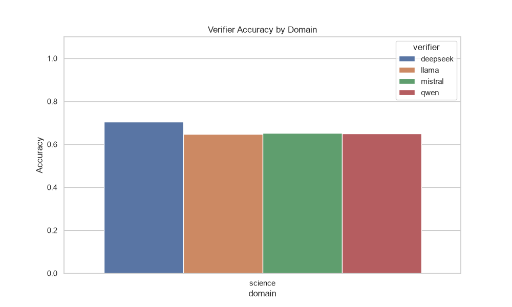
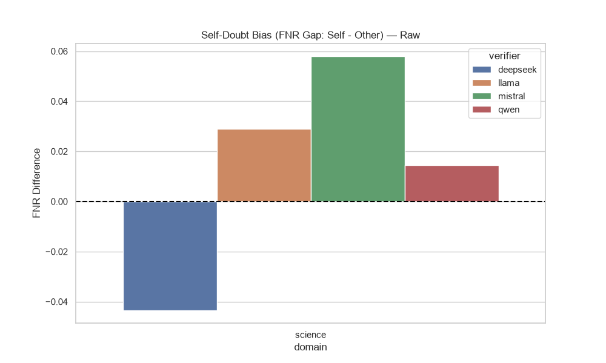
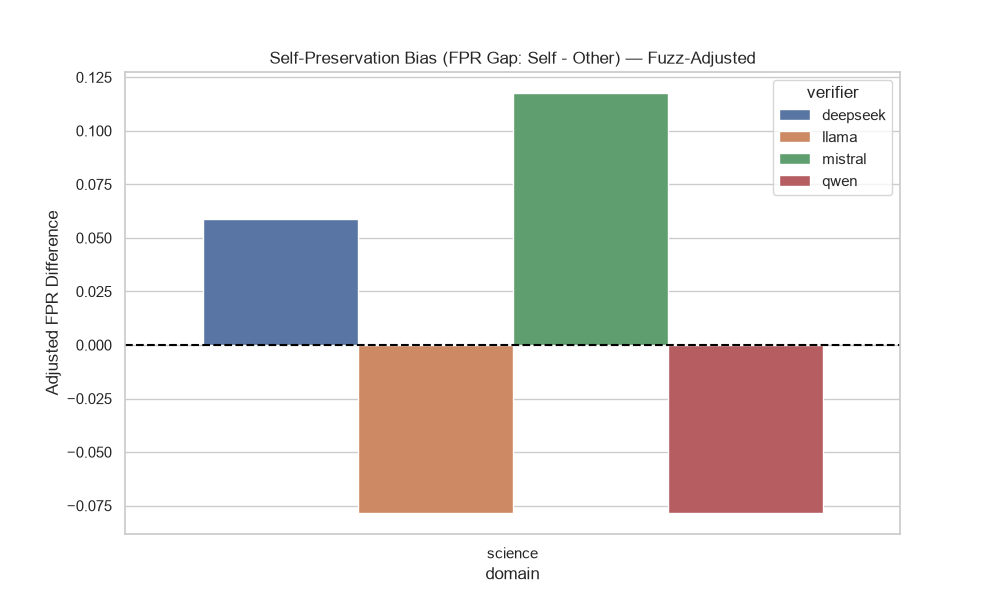
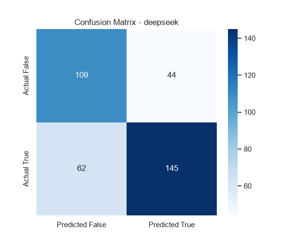
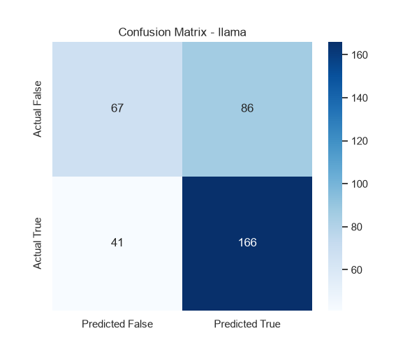
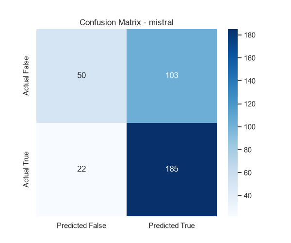
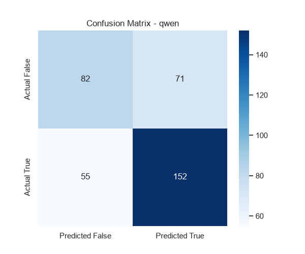

# Dynamic Executive Summary

**Total Verifications Processed:** 1440

## Highest Accuracy by Domain

- **Science**: deepseek (Frame: neutral, Strategy: direct) achieved **77.5%** accuracy (**77.5% Adjusted**).

## Model Preferences by Domain (Best Configurations)
### Science
- **deepseek**: Prefers **neutral** frame & **direct** strategy (**77.5%**)
- **llama**: Prefers **other** frame & **rubric** strategy (**67.5%**)
- **mistral**: Prefers **other** frame & **cot** strategy (**75.0%**)
- **qwen**: Prefers **neutral** frame & **cot** strategy (**67.5%**)

## Strategy Performance per Model (Raw Accuracy)
| Model | cot | direct | rubric |
|-------|---|---|---|
| **deepseek** | 66.7% | 77.5% | 67.5% |
| **llama** | 65.8% | 61.7% | 66.7% |
| **mistral** | 70.8% | 59.2% | 65.8% |
| **qwen** | 66.7% | 62.5% | 65.8% |

## Strategy Performance per Model (Adjusted Accuracy)
| Model | cot | direct | rubric |
|-------|---|---|---|
| **deepseek** | 66.7% | 77.5% | 67.5% |
| **llama** | 65.8% | 61.7% | 66.7% |
| **mistral** | 70.8% | 59.2% | 65.8% |
| **qwen** | 66.7% | 62.5% | 65.8% |

## 1. Comprehensive Accuracy Breakdown (Raw)
### Overall Average Across Everything
- **Overall**: 66.4%
### By Domain
- **Science**: 66.4%
### By Strategy
- **cot**: 67.5%
- **direct**: 65.2%
- **rubric**: 66.5%
### By Ownership Frame
- **neutral**: 65.6%
- **other**: 67.3%
- **self**: 66.2%
### By Model
- **deepseek**: 70.6%
- **llama**: 64.7%
- **mistral**: 65.3%
- **qwen**: 65.0%
### Top 3 Best Ownership + Strategy Combos
- **neutral + cot**: 68.8%
- **other + rubric**: 68.1%
- **other + cot**: 67.5%

## 1b. Comprehensive Accuracy Breakdown (Adjusted)
### Overall Average Across Everything
- **Overall**: 66.4%
### By Domain
- **Science**: 66.4%
### By Strategy
- **cot**: 67.5%
- **direct**: 65.2%
- **rubric**: 66.5%
### By Ownership Frame
- **neutral**: 65.6%
- **other**: 67.3%
- **self**: 66.2%
### By Model
- **deepseek**: 70.6%
- **llama**: 64.7%
- **mistral**: 65.3%
- **qwen**: 65.0%
### Top 3 Best Ownership + Strategy Combos
- **neutral + cot**: 68.8%
- **other + rubric**: 68.1%
- **other + cot**: 67.5%

## 2. Formatting Failure Rates (NaN / Instructions Missed)
### Overall Average Across Everything
- **Overall**: 0.0%
### By Domain
- **Science**: 0.0%
### By Strategy
- **cot**: 0.0%
- **direct**: 0.0%
- **rubric**: 0.0%
### By Ownership Frame
- **neutral**: 0.0%
- **other**: 0.0%
- **self**: 0.0%
### By Model
- **deepseek**: 0.0%
- **llama**: 0.0%
- **mistral**: 0.0%
- **qwen**: 0.0%
### Top 3 Best Ownership + Strategy Combos
- **neutral + cot**: 0.0%
- **neutral + direct**: 0.0%
- **neutral + rubric**: 0.0%

## 3. Verbosity Analysis (Average Characters)
### Overall Average Across Everything
- **Overall**: 210.3
### By Domain
- **Science**: 210.3
### By Strategy
- **cot**: 352.3
- **direct**: 0.0
- **rubric**: 278.6
### By Ownership Frame
- **neutral**: 211.9
- **other**: 211.2
- **self**: 207.8
### By Model
- **deepseek**: 208.6
- **llama**: 239.7
- **mistral**: 197.9
- **qwen**: 195.0
### Top 3 Best Ownership + Strategy Combos
- **self + cot**: 352.5
- **neutral + cot**: 352.5
- **other + cot**: 351.8

## 5. Verifier Behavior Rates
### Overall Averages
- **Overall** -> Caught: 50.3% | Passed: 49.7% | Introduced: 21.7% | Confirmed: 78.3%
### By Domain
- **science** -> Caught: 50.3% | Passed: 49.7% | Introduced: 21.7% | Confirmed: 78.3%
### By Strategy
- **cot** -> Caught: 52.9% | Passed: 47.1% | Introduced: 21.7% | Confirmed: 78.3%
- **direct** -> Caught: 41.7% | Passed: 58.3% | Introduced: 17.4% | Confirmed: 82.6%
- **rubric** -> Caught: 56.4% | Passed: 43.6% | Introduced: 26.1% | Confirmed: 73.9%
### By Ownership Frame
- **neutral** -> Caught: 48.5% | Passed: 51.5% | Introduced: 21.7% | Confirmed: 78.3%
- **other** -> Caught: 51.5% | Passed: 48.5% | Introduced: 21.0% | Confirmed: 79.0%
- **self** -> Caught: 51.0% | Passed: 49.0% | Introduced: 22.5% | Confirmed: 77.5%
### By Model
- **deepseek** -> Caught: 71.2% | Passed: 28.8% | Introduced: 30.0% | Confirmed: 70.0%
- **llama** -> Caught: 43.8% | Passed: 56.2% | Introduced: 19.8% | Confirmed: 80.2%
- **mistral** -> Caught: 32.7% | Passed: 67.3% | Introduced: 10.6% | Confirmed: 89.4%
- **qwen** -> Caught: 53.6% | Passed: 46.4% | Introduced: 26.6% | Confirmed: 73.4%

## 6. Statistical Bias (Self vs Other)
### Top 3 Highest Self-Preservation Biases (FPR Gap)
*These models were most likely to falsely approve their own mistakes.*

- **mistral** (science, cot): **+29.4%** bias
- **deepseek** (science, cot): **+11.8%** bias
- **mistral** (science, rubric): **+5.9%** bias

### Top 3 Highest Self-Doubt Biases (FNR Gap)
*These models were most likely to falsely reject their own correct answers.*

- **mistral** (science, rubric): **+13.0%** bias
- **mistral** (science, direct): **+13.0%** bias
- **llama** (science, rubric): **+8.7%** bias

### Statistical Significance (P-Values for Bias) — Raw numbers, chi-square per (verifier, domain, strategy) cell.
*Small pilot sample sizes (~20/cell) mean most will read as not significant; that's expected at this scale.*
- **mistral** (science, cot): FPR Bias p=0.1671 | FNR Bias p=0.6008
- **deepseek** (science, cot): FPR Bias p=0.7197 | FNR Bias p=1.0000
- **mistral** (science, rubric): FPR Bias p=1.0000 | FNR Bias p=0.4117

## 6b. Statistical Bias — Fuzz-Adjusted (Corrected Ground Truth)
*Same analysis as Section 6 but using fuzz-adjusted ground truth for the code domain. Rows where the fuzzer found a `REFERENCE_BUG` (reference was wrong) or `BUG_CONFIRMED` (candidate had a real bug) are reclassified before computing FPR/FNR. For math and science domains the adjusted numbers are identical to raw. Differences between raw and adjusted in code domain reflect the impact of oracle corrections.*

### Top 3 Highest Adjusted Self-Preservation Biases (Adj FPR Gap)

- **mistral** (science, cot): **+29.4%** adjusted bias
- **deepseek** (science, cot): **+11.8%** adjusted bias
- **mistral** (science, rubric): **+5.9%** adjusted bias

### Top 3 Highest Adjusted Self-Doubt Biases (Adj FNR Gap)

- **mistral** (science, rubric): **+13.0%** adjusted bias
- **mistral** (science, direct): **+13.0%** adjusted bias
- **llama** (science, rubric): **+8.7%** adjusted bias

### Statistical Significance (P-Values for Adjusted Bias)
- **mistral** (science, cot): Adj FPR Bias p=0.1671 | Adj FNR Bias p=0.6008
- **deepseek** (science, cot): Adj FPR Bias p=0.7197 | Adj FNR Bias p=1.0000
- **mistral** (science, rubric): Adj FPR Bias p=1.0000 | Adj FNR Bias p=0.4117

Full adjusted bias table: `pilot_science_adj_bias_metrics.csv`.

## 6c. Oracle & Fuzzing Statistics (Code Domain)
*These rows represent code verifications where the verifier overrode a passing execution result (i.e. test passed but verifier said incorrect). The fuzzer ran differential testing on each and an LLM oracle adjudicated mismatches. This section quantifies how often the verifier was right vs. wrong, and how often the benchmark reference itself was the problem.*

**Total override cases fuzzed:** 70

### Verdict Breakdown

| Verdict | Count | % of Fuzzed |
|---|---|---|
| `BUG_CONFIRMED` | 0 | 0.0% |
| `REFERENCE_BUG` | 0 | 0.0% |
| `NO_DISCREPANCY` | 58 | 82.9% |
| `SKIPPED_PIPELINE_FAIL` | 12 | 17.1% |

### Verdicts by Verifier Model

| Verifier | BUG_CONFIRMED | REFERENCE_BUG | NO_DISCREPANCY | SKIPPED_PIPELINE_FAIL |
|---|---|---|---|---|
| deepseek | 0 | 0 | 5 | 2 |
| llama | 0 | 0 | 10 | 0 |
| mistral | 0 | 0 | 42 | 10 |
| qwen | 0 | 0 | 1 | 0 |

### Verdicts by Generator Model

| Generator | BUG_CONFIRMED | REFERENCE_BUG | NO_DISCREPANCY | SKIPPED_PIPELINE_FAIL |
|---|---|---|---|---|
| deepseek | 0 | 0 | 32 | 10 |
| llama | 0 | 0 | 2 | 1 |
| mistral | 0 | 0 | 6 | 1 |
| qwen | 0 | 0 | 18 | 0 |

### Verifier Override Accuracy
*% of overrides that were JUSTIFIED (BUG_CONFIRMED) vs. UNJUSTIFIED (NO_DISCREPANCY or REFERENCE_BUG)*

| Verifier | Total Overrides | Justified (%) | Unjustified (%) | Inconclusive (%) |
|---|---|---|---|---|
| deepseek | 7 | 0.0% | 71.4% | 28.6% |
| llama | 10 | 0.0% | 100.0% | 0.0% |
| mistral | 52 | 0.0% | 80.8% | 19.2% |
| qwen | 1 | 0.0% | 100.0% | 0.0% |

## 7. Domain-Specific Validity Checks
*These checks are diagnostic safeguards around domain-specific grading. They support the shared metrics above; they do not replace the common accuracy/FPR/FNR analysis.*

Full table: `pilot_science_domain_validity_checks.csv`.

### Code: Execution Grounding
*Instances where the code passed the test suite, but the verifier LLM overrode that execution signal and marked it INCORRECT.*
*(No code domain data present)*

### Science: Option Extraction Audit
*Science grading uses the shared correctness metrics above, with an additional parser audit because GPQA answers must map cleanly to one of A-D.*
- **Candidate Parse Rate**: 100.0% of science verification rows had a detected A-D answer.
- **Ambiguous Candidate Rate**: 0.0% of science verification rows were marked ambiguous by the parser.
- **Best Science Generator**: llama with 70.0% generation accuracy.
- **Best Science Verifier Cell**: deepseek / neutral / direct at 77.5% accuracy.
- **Highest Science False-Approval Cell**: mistral / other / direct with 88.2% FPR.
Full science audit files: `pilot_science_science_generation_audit.csv`, `pilot_science_science_generator_summary.csv`, `pilot_science_science_verifier_diagnostics.csv`.

### Math: Answer Matching
*(No math domain data present)*

## 8. Belief vs. Reality (Told Frame vs. Actual Authorship)
*Answers Primary Question 1: does TELLING a verifier 'you wrote this' change its accuracy, independent of whether that's true? Rows below cross the told frame against ground-truth authorship (actual_source).*

| Verifier | Told Frame | Actually Self-Authored? | Accuracy | FPR |
|---|---|---|---|---|
| deepseek | other | No | 66.7% | 22.2% |
| deepseek | other | Yes | 80.0% | 40.0% |
| deepseek | self | No | 66.7% | 30.6% |
| deepseek | self | Yes | 80.0% | 40.0% |
| llama | other | No | 63.3% | 61.9% |
| llama | other | Yes | 70.0% | 33.3% |
| llama | self | No | 63.3% | 57.1% |
| llama | self | Yes | 76.7% | 11.1% |
| mistral | other | No | 72.2% | 58.3% |
| mistral | other | Yes | 63.3% | 66.7% |
| mistral | self | No | 65.6% | 66.7% |
| mistral | self | Yes | 50.0% | 86.7% |
| qwen | other | No | 64.4% | 43.6% |
| qwen | other | Yes | 63.3% | 66.7% |
| qwen | self | No | 68.9% | 30.8% |
| qwen | self | Yes | 60.0% | 75.0% |

Read this as 2x2 per verifier: (told self / actually self) vs (told self / actually other) vs (told other / actually self) vs (told other / actually other). A gap between the first two rows (same actual authorship, different label) isolates the pure *belief* effect. A gap between rows 1 and 3 (same label, different truth) isolates the pure *reality* effect. Full data: `pilot_science_belief_vs_reality.csv`.

## 9. Confusion Matrices (Visuals & Raw Data)
### deepseek
**True Positives:** 145 | **False Positives:** 44 | **True Negatives:** 109 | **False Negatives:** 62

### llama
**True Positives:** 166 | **False Positives:** 86 | **True Negatives:** 67 | **False Negatives:** 41

### mistral
**True Positives:** 185 | **False Positives:** 103 | **True Negatives:** 50 | **False Negatives:** 22

### qwen
**True Positives:** 152 | **False Positives:** 71 | **True Negatives:** 82 | **False Negatives:** 55

