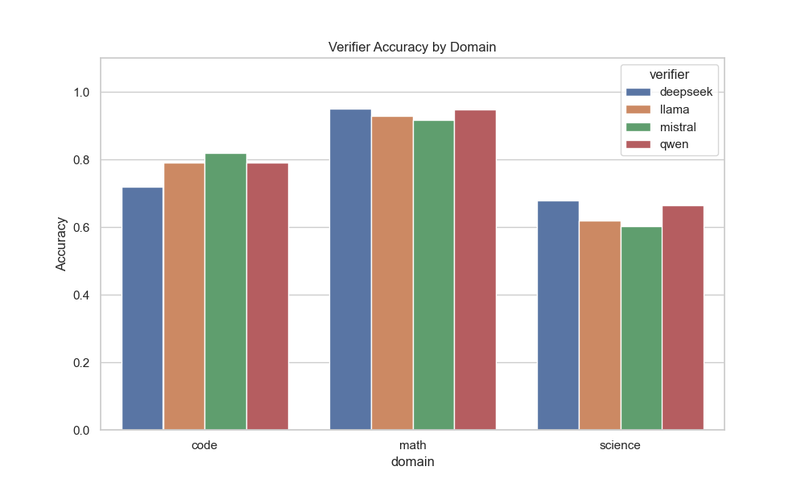
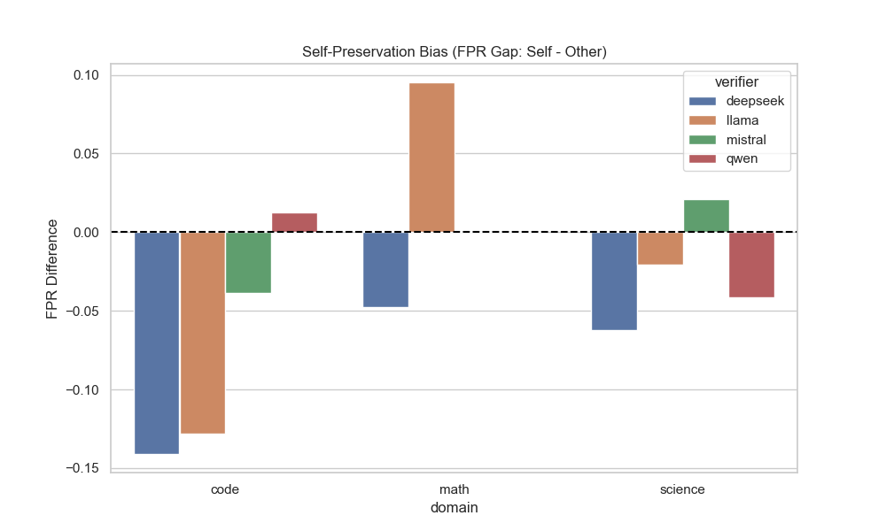
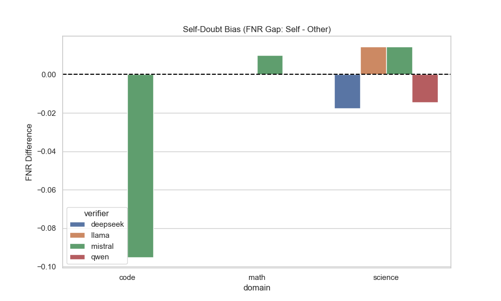
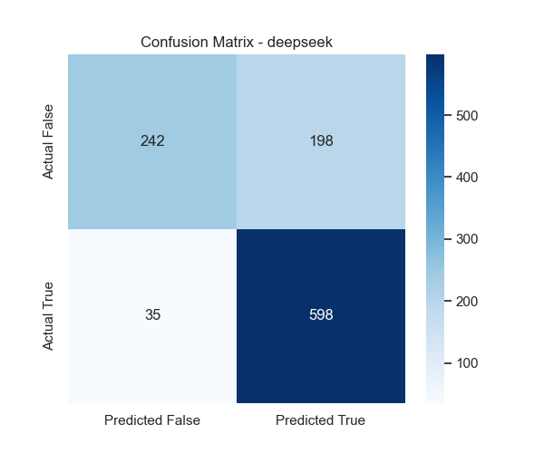
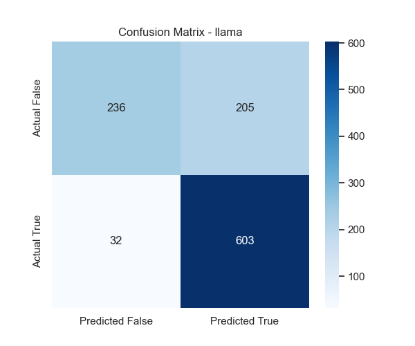
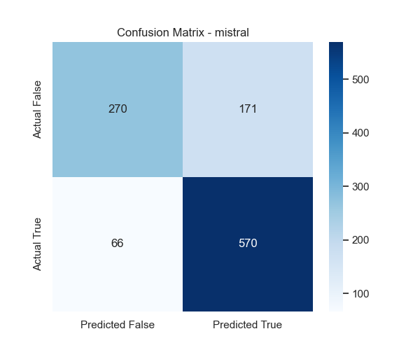
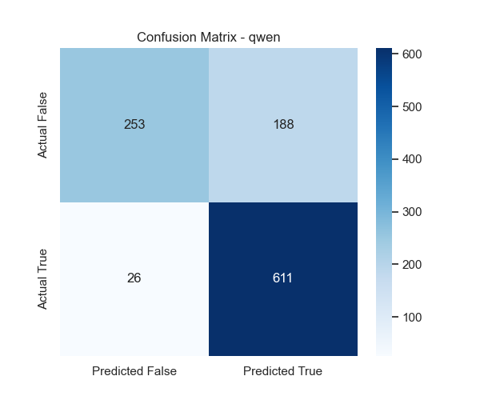

# Dynamic Executive Summary

**Total Verifications Processed:** 4320

## Highest Accuracy by Domain

- **Code**: mistral (Frame: neutral, Strategy: direct) achieved **100.0%** accuracy.
- **Math**: deepseek (Frame: self, Strategy: cot) achieved **97.5%** accuracy.
- **Science**: deepseek (Frame: self, Strategy: cot) achieved **75.0%** accuracy.

## Model Preferences by Domain (Best Configurations)
### Code
- **deepseek**: Prefers **self** frame & **direct** strategy (**87.5%**)
- **llama**: Prefers **self** frame & **cot** strategy (**87.5%**)
- **mistral**: Prefers **neutral** frame & **direct** strategy (**100.0%**)
- **qwen**: Prefers **neutral** frame & **direct** strategy (**95.0%**)
### Math
- **deepseek**: Prefers **self** frame & **cot** strategy (**97.5%**)
- **llama**: Prefers **other** frame & **cot** strategy (**95.0%**)
- **mistral**: Prefers **neutral** frame & **cot** strategy (**92.5%**)
- **qwen**: Prefers **neutral** frame & **direct** strategy (**95.0%**)
### Science
- **deepseek**: Prefers **self** frame & **cot** strategy (**75.0%**)
- **llama**: Prefers **neutral** frame & **cot** strategy (**74.4%**)
- **mistral**: Prefers **neutral** frame & **rubric** strategy (**62.5%**)
- **qwen**: Prefers **self** frame & **cot** strategy (**71.8%**)

## Strategy Performance per Model
| Model | cot | direct | rubric |
|-------|---|---|---|
| **deepseek** | 76.8% | 80.0% | 78.0% |
| **llama** | 82.2% | 74.2% | 77.5% |
| **mistral** | 74.9% | 84.2% | 74.7% |
| **qwen** | 78.2% | 83.1% | 79.2% |

## 1. Comprehensive Accuracy Breakdown
### Overall Average Across Everything
- **Overall**: 78.6%
### By Domain
- **Code**: 78.1%
- **Math**: 93.5%
- **Science**: 64.1%
### By Strategy
- **cot**: 78.0%
- **direct**: 80.3%
- **rubric**: 77.3%
### By Ownership Frame
- **neutral**: 77.9%
- **other**: 77.9%
- **self**: 80.0%
### By Model
- **deepseek**: 78.2%
- **llama**: 78.0%
- **mistral**: 77.9%
- **qwen**: 80.1%
### Top 3 Best Ownership + Strategy Combos
- **self + direct**: 81.5%
- **self + cot**: 79.8%
- **neutral + direct**: 79.8%

## 2. Formatting Failure Rates (NaN / Instructions Missed)
### Overall Average Across Everything
- **Overall**: 0.4%
### By Domain
- **Code**: 0.0%
- **Math**: 0.1%
- **Science**: 1.0%
### By Strategy
- **cot**: 1.0%
- **direct**: 0.0%
- **rubric**: 0.1%
### By Ownership Frame
- **neutral**: 0.4%
- **other**: 0.3%
- **self**: 0.3%
### By Model
- **deepseek**: 0.6%
- **llama**: 0.4%
- **mistral**: 0.3%
- **qwen**: 0.2%
### Top 3 Best Ownership + Strategy Combos
- **neutral + direct**: 0.0%
- **neutral + rubric**: 0.0%
- **other + rubric**: 0.0%

## 3. Verbosity Analysis (Average Characters)
### Overall Average Across Everything
- **Overall**: 117.8
### By Domain
- **Code**: 134.1
- **Math**: 98.7
- **Science**: 120.7
### By Strategy
- **cot**: 196.2
- **direct**: 0.0
- **rubric**: 157.3
### By Ownership Frame
- **neutral**: 117.4
- **other**: 118.0
- **self**: 118.1
### By Model
- **deepseek**: 98.0
- **llama**: 135.1
- **mistral**: 126.3
- **qwen**: 111.8
### Top 3 Best Ownership + Strategy Combos
- **neutral + cot**: 197.1
- **self + cot**: 195.8
- **other + cot**: 195.7

## 4. Dissociation Rates (Hallucinated Verdicts)
### Overall Average Across Everything
- **Overall**: 2.7%
### By Domain
- **Code**: 6.0%
- **Math**: 0.1%
- **Science**: 2.0%
### By Strategy
- **cot**: 3.8%
- **rubric**: 1.6%
### By Ownership Frame
- **neutral**: 2.4%
- **other**: 2.5%
- **self**: 3.2%
### By Model
- **deepseek**: 2.8%
- **llama**: 2.5%
- **mistral**: 1.1%
- **qwen**: 4.4%
### Top 3 Best Ownership + Strategy Combos
- **neutral + rubric**: 1.2%
- **other + rubric**: 1.5%
- **self + rubric**: 2.1%

### Dissociation Deep Dive (Reasoning vs Label)
Out of 78 hallucinated verifications:
- **Label was Right / Reasoning was Wrong**: 23.1% of the time.
- **Reasoning was Right / Label was Wrong**: 76.9% of the time.

## 5. Verifier Behavior Rates
### Overall Averages
- **Overall** -> Caught: 56.8% | Passed: 43.2% | Introduced: 6.3% | Confirmed: 93.7%
### By Domain
- **code** -> Caught: 70.8% | Passed: 29.2% | Introduced: 8.5% | Confirmed: 91.5%
- **math** -> Caught: 64.7% | Passed: 35.3% | Introduced: 0.3% | Confirmed: 99.7%
- **science** -> Caught: 30.4% | Passed: 69.6% | Introduced: 13.2% | Confirmed: 86.8%
### By Strategy
- **cot** -> Caught: 54.7% | Passed: 45.3% | Introduced: 5.5% | Confirmed: 94.5%
- **direct** -> Caught: 58.0% | Passed: 42.0% | Introduced: 4.2% | Confirmed: 95.8%
- **rubric** -> Caught: 57.7% | Passed: 42.3% | Introduced: 9.1% | Confirmed: 90.9%
### By Ownership Frame
- **neutral** -> Caught: 55.5% | Passed: 44.5% | Introduced: 6.6% | Confirmed: 93.4%
- **other** -> Caught: 55.1% | Passed: 44.9% | Introduced: 6.3% | Confirmed: 93.7%
- **self** -> Caught: 59.7% | Passed: 40.3% | Introduced: 5.9% | Confirmed: 94.1%
### By Model
- **deepseek** -> Caught: 55.0% | Passed: 45.0% | Introduced: 5.5% | Confirmed: 94.5%
- **llama** -> Caught: 53.5% | Passed: 46.5% | Introduced: 5.0% | Confirmed: 95.0%
- **mistral** -> Caught: 61.2% | Passed: 38.8% | Introduced: 10.4% | Confirmed: 89.6%
- **qwen** -> Caught: 57.4% | Passed: 42.6% | Introduced: 4.1% | Confirmed: 95.9%

## 6. Statistical Bias (Self vs Other)
### Top 3 Highest Self-Preservation Biases (FPR Gap)
*These models were most likely to falsely approve their own mistakes.*

- **llama** (math, direct): **+28.6%** bias
- **qwen** (code, cot): **+7.7%** bias
- **mistral** (science, rubric): **+6.2%** bias

### Top 3 Highest Self-Doubt Biases (FNR Gap)
*These models were most likely to falsely reject their own correct answers.*

- **llama** (science, cot): **+4.3%** bias
- **mistral** (science, cot): **+4.3%** bias
- **mistral** (math, rubric): **+3.0%** bias

### Statistical Significance (P-Values for Bias)
*Chi-Square tests on raw False Positives/Negatives between Self and Other frames, computed PER (verifier, domain, strategy) cell - i.e. each p-value tests the exact same slice of data as the bias row above it. Small pilot sample sizes (~20/cell) mean most will read as not significant; that's expected at this scale, not a null result.*
- **llama** (math, direct): FPR Bias p=0.5892 | FNR Bias p=1.0000
- **qwen** (code, cot): FPR Bias p=0.7809 | FNR Bias p=1.0000
- **mistral** (science, rubric): FPR Bias p=1.0000 | FNR Bias p=1.0000

## 7. Test Suite Overrides (Code Domain)
*Instances where the code passed the test suite (ground truth correct), but the verifier LLM overrode that signal and marked it INCORRECT.*
- **Total Overrides**: 43 out of 504 passing submissions.

### By Verifier Model
- **deepseek**: 0
- **llama**: 4
- **mistral**: 39
- **qwen**: 0

## 8. Belief vs. Reality (Told Frame vs. Actual Authorship)
*Answers Primary Question 1: does TELLING a verifier 'you wrote this' change its accuracy, independent of whether that's true? Rows below cross the told frame against ground-truth authorship (actual_source).*

| Verifier | Told Frame | Actually Self-Authored? | Accuracy | FPR |
|---|---|---|---|---|
| deepseek | other | No | 78.7% | 43.0% |
| deepseek | other | Yes | 72.2% | 66.7% |
| deepseek | self | No | 83.3% | 33.3% |
| deepseek | self | Yes | 76.4% | 54.5% |
| llama | other | No | 78.8% | 47.6% |
| llama | other | Yes | 73.3% | 50.0% |
| llama | self | No | 81.0% | 41.0% |
| llama | self | Yes | 75.6% | 45.2% |
| mistral | other | No | 79.2% | 36.3% |
| mistral | other | Yes | 72.2% | 46.7% |
| mistral | self | No | 79.9% | 36.3% |
| mistral | self | Yes | 74.4% | 42.2% |
| qwen | other | No | 79.9% | 37.5% |
| qwen | other | Yes | 78.9% | 70.4% |
| qwen | self | No | 80.7% | 36.7% |
| qwen | self | Yes | 78.9% | 70.4% |

Read this as 2x2 per verifier: (told self / actually self) vs (told self / actually other) vs (told other / actually self) vs (told other / actually other). A gap between the first two rows (same actual authorship, different label) isolates the pure *belief* effect. A gap between rows 1 and 3 (same label, different truth) isolates the pure *reality* effect. Full data: `belief_vs_reality.csv`.

## 7. Confusion Matrices (Visuals & Raw Data)
### deepseek
**True Positives:** 598 | **False Positives:** 198 | **True Negatives:** 242 | **False Negatives:** 35

### llama
**True Positives:** 603 | **False Positives:** 205 | **True Negatives:** 236 | **False Negatives:** 32

### mistral
**True Positives:** 570 | **False Positives:** 171 | **True Negatives:** 270 | **False Negatives:** 66

### qwen
**True Positives:** 611 | **False Positives:** 188 | **True Negatives:** 253 | **False Negatives:** 26

